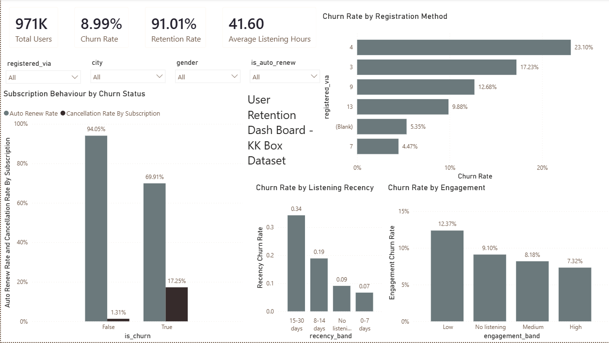

# Sound-and-Retention

## Business Problem

A music-streaming company wants to understand which listening and subscription behaviors are associated with customer churn so that retention teams can identify higher-risk customer segments.

## Dashboard
The dashboard presents churn and retention KPIs, engagement patterns, subscription behaviour, and customer-segment comparisons, with interactive filters for exploration.



## Dataset

Source: KKBox customer churn dataset, obtained from Kaggle.

The project uses four source tables:

- `train_v2.csv` — churn labels
- `members_v3.csv` — member/customer information
- `transactions_v2.csv` — subscription and payment behavior
- `user_logs_v2.csv` — listening activity

The raw source files are stored locally under `data/raw/` and are not committed to the repository.

## Business Questions

- Are highly engaged users less likely to churn?
- Does subscription behavior differ between churned and retained users?
- Which customer segments have the highest churn?
- Is recent listening activity associated with churn?

## Pipeline

### Phase 1 — Data Exploration

- Documented the source tables, fields, and their grains.
- Profiled row counts, date ranges, churn distribution, missing values, duplicates, and invalid values.
- Identified data-quality issues before transformation.

### Phase 2 — Data Preparation

#### Raw Layer

Source data is preserved in PostgreSQL with minimal transformation:

```text
PostgreSQL
└── sound_retention
    └── raw
        ├── churn
        ├── members
        ├── transactions
        └── user_logs
````

A reproducible Python loader is provided at:

```text
src/load/load_raw.py
```

The reproducible Python/Pandas ETL pipeline handles extraction,
transformation, validation, and loading before the analytical and
Power BI layers.

#### Staging Layer

Source tables are converted into consistently typed staging tables:

```text
raw.*
   ↓
staging.*
```

The staging layer standardizes dates, boolean flags, column representations, and other source-level data types while preserving the source-level grain.

#### Validation

The Python ETL performs source-level validation for:

- required columns
- missing required keys
- unexpected duplicate keys
- invalid dates
- invalid churn/flag values
- impossible numeric values

PostgreSQL performs complete-dataset grain and cross-table relationship
checks that depend on the relational dataset.

Relationship coverage warnings are retained rather than silently
discarding affected users.

The preparation flow is:

```text
data/raw/
   ↓
Python/Pandas
   ├── Extract
   ├── Transform
   ├── Validate
   └── Load
   ↓
PostgreSQL
   ├── raw.*
   ├── staging.*
   └── analytics.*
   ↓
SQL Analysis
   ↓
Findings
   ↓
Power BI
```

## Data Model

The analytical model uses explicit grains and separates descriptive
dimensions from measurable fact tables.

- `dim_user` — one row per user
- `dim_date` — one row per calendar date
- `fact_churn` — one row per labelled user
- `fact_subscription` — one row per subscription/payment transaction
- `fact_listening` — one row per user per calendar day

Transaction and listening data are aggregated to the user level before
being combined for customer-level churn analysis.

See [`docs/analytical_model.md`](docs/analytical_model.md) for the grain
definitions and modelling decisions.

See [`docs/data_model.md`](docs/data_model.md) for the ERD, keys,
relationships, and fact/dimension design.

## Analysis

The analysis uses SQL to investigate the four business questions:

- Engagement and churn
- Subscription behaviour and churn
- Customer segment differences
- Recent listening activity and churn

The SQL analysis uses multi-table joins, CTEs, CASE-based classifications,
and window functions while preserving the intended analytical grain.

The detailed business-question analysis is documented in
`docs/business_questions.md`.

## Findings

The analysis identified several patterns associated with churn:

- Lower listening engagement was associated with higher observed churn.
- Less recent listening activity was strongly associated with higher
  observed churn, with the highest observed rate among users whose last
  listening activity was 15–30 days earlier.
- Churned users showed substantially lower auto-renewal activity and
  higher cancellation activity than retained users.
- Churn rates varied substantially across registration methods and
  geographic segments.

These findings are observational associations and do not establish
causation.

Detailed evidence, interpretation, and limitations are documented in
`docs/findings.md`.

## Limitations

- The analysis identifies associations rather than causal relationships.
- Engagement categories are analytical groupings rather than validated
  business thresholds.
- Some churn-labelled users do not have corresponding records in the
  members source table, so member attributes are not available for the
  entire labelled population.
- The dataset and observation period limit what can be inferred about
  customer behaviour outside the available records.
- Segment-level differences may reflect underlying differences in
  customer composition that were not controlled for in this analysis.

Detailed limitations are documented alongside the findings in
`docs/findings.md`.
